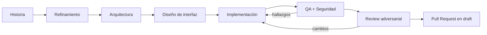

# SDLC — plugin de Claude Code

> Un Studio local para llevar una historia de usuario hasta un Pull Request en
> draft, respaldado por un plugin de Claude Code con agentes y guardrails.

[](https://github.com/arielbrizi/sdlc/actions/workflows/validate.yml)


**`sdlc` es un plugin de Claude Code.** Agrega el comando `/sdlc:us`, agentes
especializados, hooks de seguridad e integraciones para coordinar el ciclo
completo de una historia: entenderla, analizar el proyecto, diseñar la solución,
implementar, verificar y abrir el PR.

Este repositorio también incluye **Studio**, la interfaz principal del proyecto.
Studio permite elegir dónde trabajar, escribir o buscar una historia, seguir cada
fase en vivo y continuar hablando con la misma sesión de Claude al terminar.

## Empezar con Studio (recomendado)

Necesitás Claude Code instalado y autenticado, Node.js 20 o superior y Git.
Después:

```bash
git clone https://github.com/arielbrizi/sdlc.git
cd sdlc
./scripts/studio.sh
```

Abrí [http://127.0.0.1:4477](http://127.0.0.1:4477). Studio carga el plugin
directamente desde este repositorio; **no hace falta instalarlo antes en el
marketplace de Claude Code**.

En **Configuración → Proyecto de trabajo** podés:

- asociar un proyecto existente pegando su URL Git o indicando una carpeta
  local;
- crear un proyecto nuevo y vacío: Studio crea la carpeta, inicia Git en
  `main` y la deja lista para el ciclo.

Después elegí una historia del tracker o escribila en Studio y presioná
**Ejecutar ciclo**.

<p align="center">
  
</p>

El framework trabaja sobre proyectos nuevos o existentes. El developer elige el
repositorio, la branch base y —si es un monorepo— la aplicación o servicio que
la historia puede modificar. El checkout puede aislarse en un `worktree`, por
lo que el run no necesita cambiar la branch activa ni mezclar cambios locales.

<p align="center">
  
</p>

## Qué aporta

| Capacidad | Resultado |
|---|---|
| Ciclo de punta a punta | Un ID de Jira, Azure DevOps o GitHub Issues llega hasta un PR en draft |
| Historias sin tracker | El mismo flujo acepta una historia escrita directamente en el Studio |
| Proyectos nuevos o existentes | Asociación de una URL/carpeta o creación de un proyecto Git vacío desde Studio |
| Especialización | Refinamiento, arquitectura, UX, desarrollo, QA, seguridad y review tienen contratos separados |
| Corrección controlada | QA, seguridad y reviewer pueden devolver hallazgos al desarrollador hasta tres ciclos |
| Guardrails | Los hooks bloquean secretos, Git destructivo y agentes deshabilitados; también aplican formato y lint |
| Observabilidad | Estado, herramientas, hooks activados, tiempo, costo y evidencia quedan visibles durante y después del run |
| Diseño integrado | Figma define qué construir y Storybook ayuda a reutilizar lo que ya existe |

## Cómo funciona



1. Normaliza la historia a un esquema común, sin importar su origen.
2. Prepara una branch exclusiva desde la base elegida.
3. Detiene temprano las historias ambiguas o de impacto demasiado alto.
4. Delega cada responsabilidad a un subagente con herramientas y contrato de
   salida explícitos.
5. Ejecuta QA y seguridad en paralelo; el desarrollador recibe juntos sus
   hallazgos.
6. Repite como máximo tres ciclos correctivos y hace una revisión adversarial
   antes de abrir el PR.
7. Conserva la sesión para que el developer pueda preguntar, pedir ajustes o
   inspeccionar decisiones sin reconstruir el contexto.

El PR es el gate humano. El flujo puede ser autónomo, pero nunca hace merge por
su cuenta.

## Usar el plugin directamente en Claude Code

Esta alternativa sirve si preferís ejecutar `/sdlc:us` dentro de Claude Code
sin abrir Studio. Abrí una terminal en la carpeta de tu proyecto y ejecutá:

```bash
claude plugin marketplace add arielbrizi/sdlc
claude plugin install sdlc@sdlc --scope project
```

El primer comando le dice a Claude Code dónde descargar plugins. `arielbrizi`
es solamente el usuario de GitHub que aloja este repositorio: **no forma parte
del nombre del plugin**. Se ejecuta una sola vez por computadora. El segundo
instala el plugin `sdlc` para el proyecto abierto y registra esa elección en
`.claude/settings.json` para que pueda compartirse con el equipo.

Ambos comandos configuran la herramienta; no ejecutan agentes ni modifican el
código del producto. Si querés comprobar la instalación:

```bash
claude plugin details sdlc
```

Si muestra la versión y los componentes sin errores, ya está disponible.

| Término | Explicación simple |
|---|---|
| Plugin | El paquete que contiene el proceso, los agentes y las reglas de seguridad |
| Marketplace | Nombre técnico que usa Claude Code para una fuente de plugins; acá es este repositorio de GitHub |
| Proyecto | El repositorio o carpeta de código sobre la que va a trabajar el equipo |
| `arielbrizi/sdlc` | Ubicación de este repositorio en GitHub |
| `sdlc@sdlc` | Plugin `sdlc` instalado desde la fuente localmente llamada `sdlc` |

### Ejecutar una historia desde Claude Code

Estos comandos se escriben dentro de una conversación de Claude Code, no en la
terminal del sistema. Todos inician el mismo ciclo; lo único que cambia es el
tipo de identificador de la historia.

```text
/sdlc:us PROJ-1234   # Jira
/sdlc:us 8891        # Azure DevOps
/sdlc:us #245        # GitHub Issues
```

`/sdlc:us` significa “usar el flujo de historias del plugin”. Lo que
aparece después —por ejemplo `PROJ-1234`— identifica la historia que Claude debe
leer e implementar.

No hace falta memorizar el comando completo. También podés escribir pedidos
normales como `implementá PROJ-1234` o `arrancá con el ticket 8891`; Claude Code
reconoce la intención y dispara el mismo ciclo.

## Studio

Studio es la experiencia principal del proyecto: un panel local sin dependencias
npm. Lee el plugin desde disco, edita sus componentes y ejecuta Claude Code
sobre el proyecto asociado. Escucha solamente en `127.0.0.1`.

Sus cuatro secciones cubren el ciclo completo:

| Sección | Para qué sirve |
|---|---|
| Ciclo | Muestra fases, componentes, agentes habilitados y ciclos correctivos en tiempo real |
| Catálogo | Inspecciona skills, referencias, subagentes, hooks, scripts, MCP servers y manifiestos |
| Historia | Permite ejecutar sin tracker a partir de título, descripción y criterios de aceptación |
| Configuración | Asocia o crea el proyecto, define permisos y conecta Figma o Storybook |

La consola inferior conserva el stream de herramientas y la conversación. Al
terminar el ciclo, la sesión queda abierta en vez de perder el contexto.

<p align="center">
  
</p>

La documentación completa del panel está en
[`studio/README.md`](./studio/README.md).

## Agentes y responsabilidades

| Subagente | Responsabilidad | Escritura de producto |
|---|---|---|
| `@refinamiento` | Valida que la historia sea clara, completa y testeable | No |
| `@arquitectura` | Analiza el codebase y produce el plan técnico | No |
| `@ux` | Traduce Figma y el design system a un contrato de UI | No |
| `@desarrollador` | Implementa, prueba y aplica correcciones | Sí |
| `@qa` | Verifica criterios, regresiones y casos de borde | No |
| `@seguridad` | Revisa OWASP, secretos, autorización y dependencias | No |
| `@reviewer` | Busca razones concretas para rechazar el diff | No |

Quien audita no corrige. La separación evita que un agente apruebe sus propios
cambios y deja un único responsable de modificar el producto.

## Hooks y políticas

Las decisiones que no admiten interpretación viven en hooks, no en prompts.

| Momento | Hook | Política |
|---|---|---|
| `PreToolUse` | `guard-secrets.sh` | Impide leer o escribir secretos y credenciales |
| `PreToolUse` | `guard-git.sh` | Bloquea force push, `reset --hard` y escrituras sobre branches protegidas |
| `PreToolUse` | `guard-agents.sh` | Impide invocar un agente deshabilitado en el repo |
| `PostToolUse` | `format-and-lint.sh` | Formatea y linta los archivos modificados |
| `SubagentStop` | `log-run.sh` | Registra cierre y veredicto cuando el runtime los expone |

Estos controles no reemplazan CI ni la revisión humana del PR. Protegen el run
local y hacen determinísticas las reglas que no deberían depender del criterio
del modelo.

## Integraciones

| Integración | Uso | Autenticación |
|---|---|---|
| Jira | Leer historias y comentar el resultado | OAuth de Claude Code |
| Azure DevOps | Leer work items y actualizar el ticket | `ADO_ORG` y login inicial |
| GitHub | Leer issues y abrir PRs | `GITHUB_TOKEN` |
| Figma | Obtener el frame y el contrato visual de la feature | Botón **Conectar Figma** del Studio |
| Storybook | Detectar componentes y variantes existentes | Configuración local del repo |

El Studio comprueba Figma antes del run y abre el OAuth fuera de la ejecución
headless. La autorización se hace una sola vez por computadora; Claude Code
guarda y renueva la credencial. Como alternativa técnica, se puede ejecutar
`claude --plugin-dir plugins/sdlc mcp login plugin:sdlc:figma`.

## Evidencia de cada run

Cada ejecución deja artefactos estructurados en `.claude/run/<ID>/`:

```text
.claude/run/PROJ-1234/
├── run.json
├── story.json
├── config.json
├── git.json
├── refinement.json
├── architecture.json
├── plan.md
├── design.json
├── implementation.json
├── qa.json
├── security.json
├── review.json
├── hook-events.jsonl
└── timeline.log
```

Podés ignorar `.claude/run/` o versionarlo cuando el proyecto necesite
evidencia de compliance. La decisión es del repositorio objetivo.

## Arquitectura del repositorio

```text
.
├── .claude-plugin/marketplace.json    # índice de instalación para Claude Code
├── plugins/sdlc/
│   ├── .claude-plugin/plugin.json   # manifiesto y versión
│   ├── skills/us/                    # skill orquestadora
│   ├── agents/                       # subagentes especializados
│   ├── hooks/hooks.json              # políticas determinísticas
│   ├── scripts/                      # hooks y utilidades
│   └── .mcp.json                     # trackers y diseño
├── studio/                            # panel local
├── scripts/validate.sh                # mismo control que CI
└── docs/                              # decisiones y capturas
```

Las razones detrás de la arquitectura están registradas en
[`docs/decisiones.md`](./docs/decisiones.md). El detalle operativo del plugin
está en [`plugins/sdlc/README.md`](./plugins/sdlc/README.md).

## Desarrollo y contribución

```bash
git clone https://github.com/arielbrizi/sdlc.git
cd sdlc
chmod +x plugins/*/scripts/*.sh scripts/*.sh
./scripts/validate.sh
```

Para iterar contra un repositorio sandbox sin instalar el plugin:

```bash
cd ~/repos/sandbox
claude --plugin-dir ~/repos/sdlc/plugins/sdlc
```

Antes de abrir un PR:

1. Ejecutá `./scripts/validate.sh`.
2. Probá el flujo end-to-end contra un ticket real en un repo sandbox.
3. Si tocaste un hook, verificá tanto el bloqueo correcto como la ausencia de
   falsos positivos.
4. Si tocaste el plugin, actualizá la versión de
   `plugins/sdlc/.claude-plugin/plugin.json`.
5. Documentá qué cambió y qué verificaste.

## Documentación

- [Plugin `sdlc`](./plugins/sdlc/README.md)
- [Studio](./studio/README.md)
- [Decisiones de diseño](./docs/decisiones.md)
- [Reglas para contribuir](./CLAUDE.md)

---

Uso interno. El plugin permanece en `0.x` mientras se valida en
pilotos; la versión efectiva siempre es la declarada en
[`plugin.json`](./plugins/sdlc/.claude-plugin/plugin.json).
