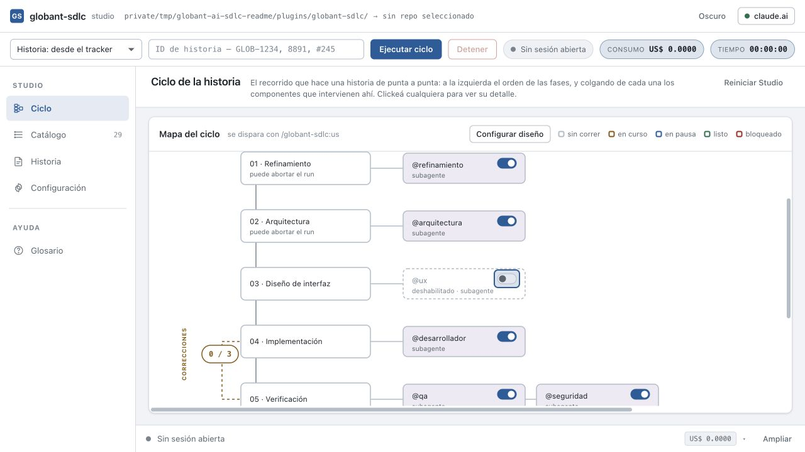
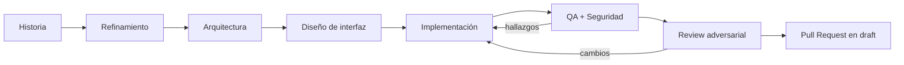
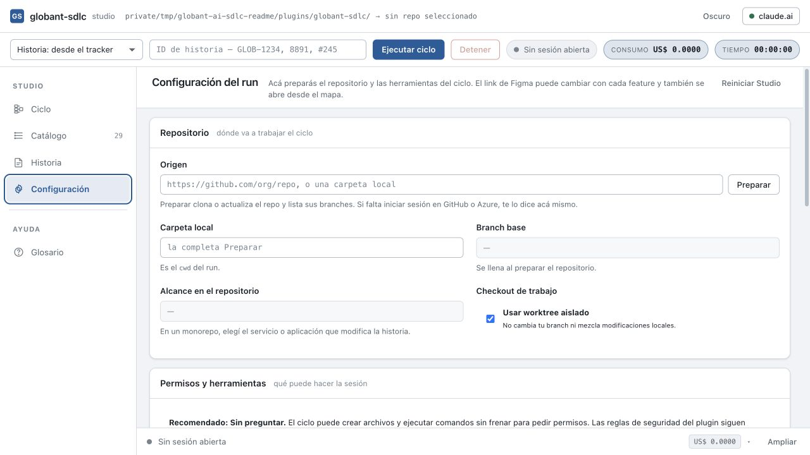
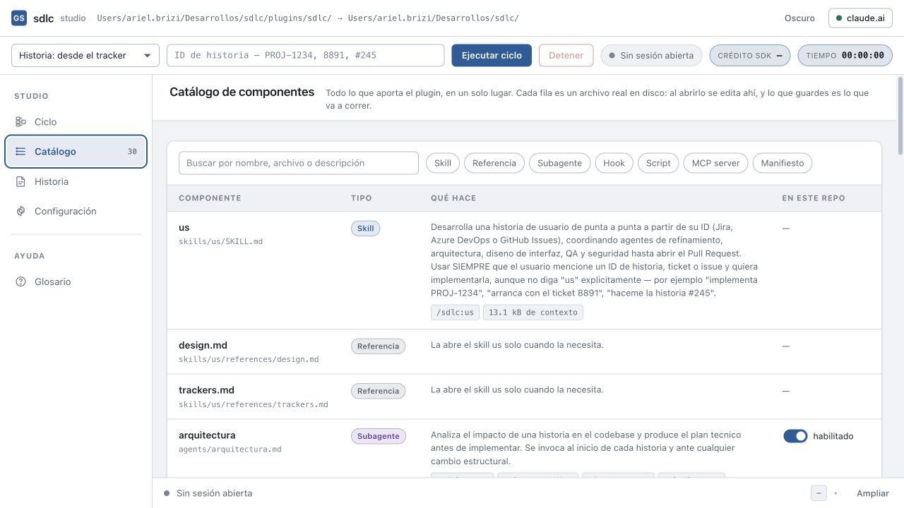

# Globant AI SDLC

> De una historia de usuario a un Pull Request en draft, con agentes
> especializados, controles determinísticos y trazabilidad de punta a punta.

[](https://github.com/arielbrizi/sdlc/actions/workflows/validate.yml)


Este repositorio publica
[`globant-sdlc`](./plugins/globant-sdlc), un plugin de Claude Code que coordina
el ciclo completo de una historia: entiende el requerimiento, analiza el
repositorio, diseña la solución, implementa, verifica y abre el PR.

El framework trabaja sobre proyectos nuevos o existentes. El developer elige el
repositorio, la branch base y —si es un monorepo— la aplicación o servicio que
la historia puede modificar. El checkout puede aislarse en un `worktree`, por
lo que el run no necesita cambiar la branch activa ni mezclar cambios locales.

<p align="center">
  
</p>

## Qué aporta

| Capacidad | Resultado |
|---|---|
| Ciclo de punta a punta | Un ID de Jira, Azure DevOps o GitHub Issues llega hasta un PR en draft |
| Historias sin tracker | El mismo flujo acepta una historia escrita directamente en el Studio |
| Trabajo sobre repos existentes | Selección explícita de repo, branch base y alcance dentro de un monorepo |
| Especialización | Refinamiento, arquitectura, UX, desarrollo, QA, seguridad y review tienen contratos separados |
| Corrección controlada | QA, seguridad y reviewer pueden devolver hallazgos al desarrollador hasta tres ciclos |
| Guardrails | Los hooks bloquean secretos, Git destructivo y agentes deshabilitados; también aplican formato y lint |
| Observabilidad | Estado, herramientas, tiempo, costo y evidencia quedan visibles durante y después del run |
| Diseño integrado | Figma define qué construir y Storybook ayuda a reutilizar lo que ya existe |

## Cómo funciona



1. Normaliza la historia a un esquema común, sin importar su origen.
2. Prepara una branch exclusiva desde la base elegida.
3. Detiene temprano las historias ambiguas o de impacto demasiado alto.
4. Delega cada responsabilidad a un subagente con herramientas y contrato de
   salida explícitos.
5. Ejecuta QA y seguridad en paralelo; el desarrollador recibe juntos sus
   hallazgos.
6. Repite como máximo tres ciclos correctivos y hace una revisión adversarial
   antes de abrir el PR.
7. Conserva la sesión para que el developer pueda preguntar, pedir ajustes o
   inspeccionar decisiones sin reconstruir el contexto.

El PR es el gate humano. El flujo puede ser autónomo, pero nunca hace merge por
su cuenta.

## Inicio rápido

### Requisitos

- Claude Code instalado y autenticado.
- Node.js 20 o superior para el Studio.
- Git y acceso al repositorio objetivo.
- Credenciales del tracker que use el equipo; no hacen falta para historias
  escritas manualmente.

### Instalar el plugin

Estos comandos se escriben en una terminal. No ejecutan una historia ni cambian
el código del producto: solamente conectan e instalan la herramienta.

#### 1. Registrar este repositorio como fuente

```bash
claude plugin marketplace add arielbrizi/sdlc
```

Registra `arielbrizi/sdlc` como la ubicación desde la que Claude Code puede
descargar `globant-sdlc`. No se conecta a un catálogo de Globant ni a otro
servicio corporativo. La palabra `marketplace` aparece porque es el nombre
técnico que usa el comando de Claude Code para registrar un repositorio que
publica plugins.

Después de este paso Claude Code conoce la fuente, pero todavía no instala el
plugin en ningún proyecto.

Este paso se hace una sola vez por computadora.

#### 2. Instalarlo en el proyecto

Primero abrí la terminal dentro de la carpeta del proyecto donde querés trabajar
y ejecutá:

```bash
claude plugin install globant-sdlc@globant --scope project
```

Descarga el plugin y lo asocia con ese proyecto. `--scope project` significa
“para este proyecto y para todo el equipo”, no solamente para la persona que lo
instala. La referencia queda registrada en `.claude/settings.json` y puede
compartirse junto con el resto del código.

Este comando no inicia agentes, no crea una branch y no modifica archivos del
producto. Solo deja el plugin disponible para cuando se ejecute una historia.

#### 3. Comprobar que quedó instalado

```bash
claude plugin details globant-sdlc
```

Muestra la ficha del plugin: versión, componentes y estado de carga. Es una
consulta de diagnóstico; no cambia ninguna configuración. Si devuelve los
datos de `globant-sdlc` sin errores, la instalación está lista.

| Término | Explicación simple |
|---|---|
| Plugin | El paquete que contiene el proceso, los agentes y las reglas de seguridad |
| Marketplace | Nombre técnico que usa Claude Code para una fuente de plugins; acá es este repositorio de GitHub |
| Proyecto | El repositorio o carpeta de código sobre la que va a trabajar el equipo |
| `globant-sdlc@globant` | El plugin `globant-sdlc`; `globant` es el alias técnico declarado por este repositorio, no un catálogo externo |

### Ejecutar una historia

Estos comandos se escriben dentro de una conversación de Claude Code, no en la
terminal del sistema. Todos inician el mismo ciclo; lo único que cambia es el
tipo de identificador de la historia.

```text
/globant-sdlc:us GLOB-1234   # Jira
/globant-sdlc:us 8891        # Azure DevOps
/globant-sdlc:us #245        # GitHub Issues
```

`/globant-sdlc:us` significa “usar el flujo de historias del plugin”. Lo que
aparece después —por ejemplo `GLOB-1234`— identifica la historia que Claude debe
leer e implementar.

No hace falta memorizar el comando completo. También podés escribir pedidos
normales como `implementá GLOB-1234` o `arrancá con el ticket 8891`; Claude Code
reconoce la intención y dispara el mismo ciclo.

## Trabajar sobre un proyecto existente

El Studio no asume una ruta, branch ni alcance. La selección se hace de forma
explícita para evitar ejecutar una historia sobre el proyecto equivocado.

```bash
git clone https://github.com/arielbrizi/sdlc.git
cd sdlc
./scripts/studio.sh
```

Abrí [http://127.0.0.1:4477](http://127.0.0.1:4477) y completá:

1. **Origen:** una URL Git o una carpeta local existente.
2. **Preparar:** clona o actualiza el repositorio y descubre sus branches.
3. **Branch base:** la referencia desde la que se creará el trabajo.
4. **Alcance:** todo el repo o una aplicación/servicio detectado en el monorepo.
5. **Checkout:** mantené activado el worktree aislado si no querés tocar tu
   checkout actual.
6. **Historia:** elegí un tracker o escribila en el Studio y presioná
   **Ejecutar ciclo**.

Una ruta inválida no genera errores al abrir la plataforma: se valida cuando
el usuario intenta preparar o ejecutar el repositorio. La configuración de
agentes, Figma y Storybook se guarda en
`<repo>/.claude/globant-sdlc.json`, por lo que pertenece al proyecto y puede
versionarse con él.

<p align="center">
  
</p>

## Studio

El Studio es un panel local sin dependencias npm. Lee el plugin desde disco,
edita sus componentes y ejecuta Claude Code sobre el repositorio seleccionado.
Escucha solamente en `127.0.0.1`.

Sus cuatro secciones cubren el ciclo completo:

| Sección | Para qué sirve |
|---|---|
| Ciclo | Muestra fases, componentes, agentes habilitados y ciclos correctivos en tiempo real |
| Catálogo | Inspecciona skills, referencias, subagentes, hooks, scripts, MCP servers y manifiestos |
| Historia | Permite ejecutar sin tracker a partir de título, descripción y criterios de aceptación |
| Configuración | Prepara el repo, define permisos y conecta Figma o Storybook |

La consola inferior conserva el stream de herramientas y la conversación. Al
terminar el ciclo, la sesión queda abierta en vez de perder el contexto.

<p align="center">
  
</p>

La documentación completa del panel está en
[`studio/README.md`](./studio/README.md).

## Agentes y responsabilidades

| Subagente | Responsabilidad | Escritura de producto |
|---|---|---|
| `@refinamiento` | Valida que la historia sea clara, completa y testeable | No |
| `@arquitectura` | Analiza el codebase y produce el plan técnico | No |
| `@ux` | Traduce Figma y el design system a un contrato de UI | No |
| `@desarrollador` | Implementa, prueba y aplica correcciones | Sí |
| `@qa` | Verifica criterios, regresiones y casos de borde | No |
| `@seguridad` | Revisa OWASP, secretos, autorización y dependencias | No |
| `@reviewer` | Busca razones concretas para rechazar el diff | No |

Quien audita no corrige. La separación evita que un agente apruebe sus propios
cambios y deja un único responsable de modificar el producto.

## Hooks y políticas

Las decisiones que no admiten interpretación viven en hooks, no en prompts.

| Momento | Hook | Política |
|---|---|---|
| `PreToolUse` | `guard-secrets.sh` | Impide leer o escribir secretos y credenciales |
| `PreToolUse` | `guard-git.sh` | Bloquea force push, `reset --hard` y escrituras sobre branches protegidas |
| `PreToolUse` | `guard-agents.sh` | Impide invocar un agente deshabilitado en el repo |
| `PostToolUse` | `format-and-lint.sh` | Formatea y linta los archivos modificados |
| `SubagentStop` | `log-run.sh` | Registra cierre y veredicto cuando el runtime los expone |

Estos controles no reemplazan CI ni la revisión humana del PR. Protegen el run
local y hacen determinísticas las reglas que no deberían depender del criterio
del modelo.

## Integraciones

| Integración | Uso | Autenticación |
|---|---|---|
| Jira | Leer historias y comentar el resultado | OAuth desde `/mcp` |
| Azure DevOps | Leer work items y actualizar el ticket | `ADO_ORG` y login inicial |
| GitHub | Leer issues y abrir PRs | `GITHUB_TOKEN` |
| Figma | Obtener el frame y el contrato visual de la feature | OAuth desde `/mcp` |
| Storybook | Detectar componentes y variantes existentes | Configuración local del repo |

Antes de un run headless, abrí una sesión interactiva y autorizá desde
`/mcp` las integraciones que use el proyecto.

## Evidencia de cada run

Cada ejecución deja artefactos estructurados en `.claude/run/<ID>/`:

```text
.claude/run/GLOB-1234/
├── run.json
├── story.json
├── config.json
├── git.json
├── refinement.json
├── architecture.json
├── plan.md
├── design.json
├── implementation.json
├── qa.json
├── security.json
├── review.json
└── timeline.log
```

Podés ignorar `.claude/run/` o versionarlo cuando el proyecto necesite
evidencia de compliance. La decisión es del repositorio objetivo.

## Arquitectura del repositorio

```text
.
├── .claude-plugin/marketplace.json    # índice de instalación para Claude Code
├── plugins/globant-sdlc/
│   ├── .claude-plugin/plugin.json   # manifiesto y versión
│   ├── skills/us/                    # skill orquestadora
│   ├── agents/                       # subagentes especializados
│   ├── hooks/hooks.json              # políticas determinísticas
│   ├── scripts/                      # hooks y utilidades
│   └── .mcp.json                     # trackers y diseño
├── studio/                            # panel local
├── scripts/validate.sh                # mismo control que CI
└── docs/                              # decisiones y capturas
```

Las razones detrás de la arquitectura están registradas en
[`docs/decisiones.md`](./docs/decisiones.md). El detalle operativo del plugin
está en [`plugins/globant-sdlc/README.md`](./plugins/globant-sdlc/README.md).

## Desarrollo y contribución

```bash
git clone https://github.com/arielbrizi/sdlc.git
cd sdlc
chmod +x plugins/*/scripts/*.sh scripts/*.sh
./scripts/validate.sh
```

Para iterar contra un repositorio sandbox sin instalar el plugin:

```bash
cd ~/repos/sandbox
claude --plugin-dir ~/repos/sdlc/plugins/globant-sdlc
```

Antes de abrir un PR:

1. Ejecutá `./scripts/validate.sh`.
2. Probá el flujo end-to-end contra un ticket real en un repo sandbox.
3. Si tocaste un hook, verificá tanto el bloqueo correcto como la ausencia de
   falsos positivos.
4. Si tocaste el plugin, actualizá la versión de
   `plugins/globant-sdlc/.claude-plugin/plugin.json`.
5. Documentá qué cambió y qué verificaste.

## Documentación

- [Plugin `globant-sdlc`](./plugins/globant-sdlc/README.md)
- [Studio](./studio/README.md)
- [Decisiones de diseño](./docs/decisiones.md)
- [Reglas para contribuir](./CLAUDE.md)

---

Uso interno de Globant. El plugin permanece en `0.x` mientras se valida en
pilotos; la versión efectiva siempre es la declarada en
[`plugin.json`](./plugins/globant-sdlc/.claude-plugin/plugin.json).
